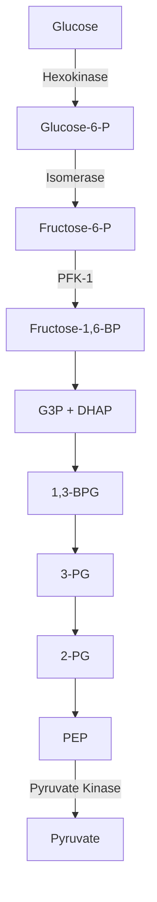
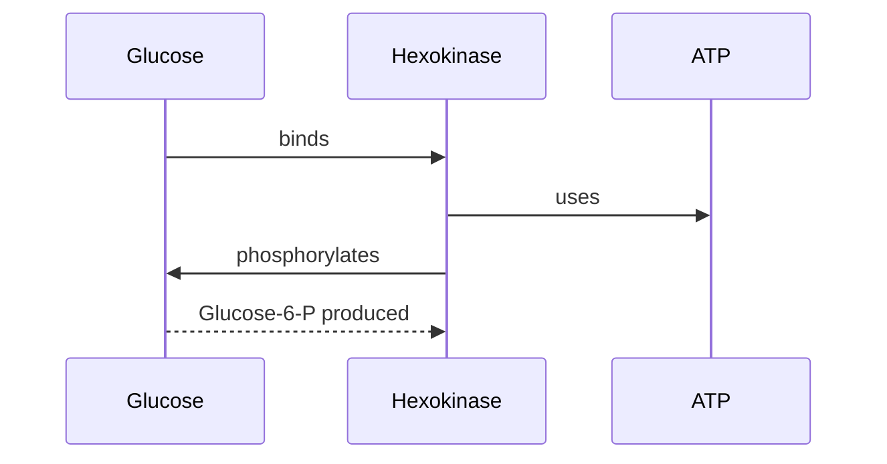

# Ken Content Creation Guide

This document defines the exact file formats, conventions, and examples needed to create content for `ken`. Any AI model or human can use this as the single reference for generating study materials.

## Directory Structure

```
~/Documents/learn/subjects/
└── <subject-name>/
    ├── groups.yaml           ← course group divisions (optional)
    ├── concepts/
    │   ├── topic-1.md
    │   └── topic-2.md
    ├── flashcards/
    │   ├── topic-1.md
    │   └── topic-2.md
    ├── quizzes/
    │   ├── topic-1.md
    │   └── topic-2.md
    └── notes/              ← raw readable content (lecture slides, textbook extracts)
        ├── lecture-1.md
        └── chapter-14.md
```

- **Subject name**: lowercase, hyphenated (e.g., `biochemistry`, `cell-biology`)
- **One file = one set**: each `.md` file contains a set of related concepts, cards, or questions
- **IDs must be unique per subject** across ALL files (concepts, flashcards, quizzes)
- **No `progress.json` needed** — ken creates it automatically on first run
- **`groups.yaml`**: optional structural divisions (e.g., "Bioenergetics", "Enzymes")
- **`notes/`**: raw readable content — lecture slides, textbook extracts, any markdown you want to read

---

## Course Groups (groups.yaml)

Location: `<subject-name>/groups.yaml` (optional)

Course groups are structural divisions of the subject — think of them as chapters or modules. They help organize the concept tree and enable group-based filtering in `ken map`.

### Format

```yaml
groups:
  - id: bioenergetics
    name: Bioenergetics
    concepts:
      - c-atp
      - c-phosphocreatine
      - c-creatine-kinase
  - id: glycolysis
    name: Glycolysis
    concepts:
      - c-glycolysis
      - c-hexokinase
      - c-pfk1
      - c-pyruvate-kinase
  - id: tca-cycle
    name: TCA Cycle
    concepts:
      - c-pyruvate-dehydrogenase
      - c-citrate-synthase
      - c-aconitase
```

### Fields

| Field | Required | Description |
|-------|----------|-------------|
| `id` | Yes | Unique group ID (lowercase, hyphenated) |
| `name` | Yes | Human-readable display name |
| `concepts` | Yes | Array of concept IDs belonging to this group |

### Rules

- A concept can belong to **multiple groups** (e.g., `c-atp` could appear in both "Bioenergetics" and "TCA Cycle")
- Groups are **structural, not temporal** — they represent the course structure, not study weeks
- If `groups.yaml` doesn't exist, the subject has no groups (valid — groups are optional)
- Group IDs must be unique within the subject

### Using Groups

```bash
ken map <subject> --group bioenergetics   # filter to one group
ken map <subject>                          # show all concepts
```

---

## YAML Frontmatter Rules

Every concept, flashcard, and quiz file starts with YAML frontmatter delimited by `---`.

### CRITICAL: File Structure

```yaml
---
format_version: 1
type: concept_set
set: Topic Name
concepts:
  - id: c-example
    name: Example Concept
    parent_id: null
---
<markdown body goes here>
```

**Rules:**
1. File MUST start with `---` on the very first line
2. YAML frontmatter comes first
3. Closing `---` is required after the YAML
4. Markdown body comes after the closing `---`

### CRITICAL: YAML Quoting Rules

**Quote values containing colons:**
```yaml
# WRONG - breaks YAML
front: What is the boundary: the edge?
back: Anterolaterally: muscles. Posteriorly: vertebrae.

# CORRECT - quote the value
front: "What is the boundary: the edge?"
back: "Anterolaterally: muscles. Posteriorly: vertebrae."
```

**Quote values with embedded quotes:**
```yaml
# WRONG - breaks YAML
back: "C3, 4, 5 keep the diaphragm alive" — the phrenic nerve...

# CORRECT - quote the entire value
back: "\"C3, 4, 5 keep the diaphragm alive\" — the phrenic nerve..."

# BETTER - use single quotes inside
back: "'C3, 4, 5 keep the diaphragm alive' — the phrenic nerve..."
```

**Quote values with special YAML characters:**
```yaml
# These characters need quoting: : { } [ ] , & * # | > ! % @ `
question: "What is 2+2?"
back: "ATP → ADP + Pi"
front: "What does PFK-1 stand for?"
```

**When in doubt, quote it:**
```yaml
# Safe format - always works
front: "Your question here"
back: "Your answer here"
explanation: "Your explanation here"
```

### YAML Quick Reference

| Format | Example | Notes |
|--------|---------|-------|
| Simple string | `name: Glycolysis` | No special chars |
| Quoted string | `front: "What is 2+2?"` | Contains `:` or other specials |
| Multi-line | `source: \|` | Use `>` for folded, `\|` for literal |
| Null | `parent_id: null` | Or omit field entirely |
| Boolean | `answer: true` | Lowercase `true`/`false` |
| Integer | `answer: 3` | No quotes |
| Array | `tags: [a, b, c]` | Or use `- item` format |
| Nested array | `options:` then `- item` | One per line |

---

## Concept Files

Location: `concepts/<topic>.md`

Concepts define what the learner is studying. Each concept can have a parent (hierarchy), a description, a summary, and diagrams.

### Full Format

```markdown
---
format_version: 1
type: concept_set
set: Glycolysis
concepts:
  - id: c-glycolysis
    name: Glycolysis
    parent_id: null
  - id: c-pfk1
    name: Phosphofructokinase-1
    parent_id: c-glycolysis
  - id: c-hexokinase
    name: Hexokinase
    parent_id: c-glycolysis
  - id: c-pyruvate-kinase
    name: Pyruvate Kinase
    parent_id: c-glycolysis
---

## c-glycolysis
The metabolic pathway that breaks down glucose into pyruvate, yielding a net 2 ATP.

## c-glycolysis:summary
Glycolysis is the first step of cellular respiration, occurring in the cytoplasm.
It converts glucose to two molecules of pyruvate, producing a net gain of 2 ATP
and 2 NADH. The pathway consists of 10 enzymatic steps divided into two phases:
the energy investment phase (steps 1-5) and the energy payoff phase (steps 6-10).

## c-pfk1
The rate-limiting, committed enzyme of glycolysis. Catalyzes the phosphorylation
of fructose-6-phosphate to fructose-1,6-bisphosphate using ATP.

## c-pfk1:summary
PFK-1 is the key regulatory enzyme of glycolysis. It catalyzes the committed step
— the first irreversible reaction unique to glycolysis. Regulated allosterically:
- Inhibited by: ATP, citrate
- Activated by: AMP, fructose-2,6-bisphosphate
This regulation ensures glycolysis slows when energy is abundant and speeds up
when energy is needed.

## c-hexokinase
The first enzyme of glycolysis. Phosphorylates glucose to glucose-6-phosphate
using ATP.

## c-hexokinase:summary
Hexokinase catalyzes the first committed step of glucose metabolism. In the liver,
the isoform glucokinase serves the same role but with different kinetic properties
(higher Km, no product inhibition).

## c-pyruvate-kinase
The final enzyme of glycolysis. Catalyzes the transfer of a phosphate from
phosphoenolpyruvate (PEP) to ADP, yielding pyruvate and ATP.

## c-pyruvate-kinase:summary
Pyruvate kinase catalyzes the last step of glycolysis, producing the second
ATP via substrate-level phosphorylation. Regulated by:
- Activated by: fructose-1,6-bisphosphate (feedforward activation)
- Inhibited by: ATP, alanine
```

### Concept Fields

| Field | Required | Description |
|-------|----------|-------------|
| `id` | Yes | Unique ID. Prefix with `c-` by convention. Must be unique across ALL files in the subject |
| `name` | Yes | Human-readable name |
| `parent_id` | No | ID of parent concept for hierarchy. `null` or omit for root concepts |

### Body Sections

- `## <concept-id>` — Concept description (free text, supports markdown)
- `## <concept-id>:summary` — Summary of the concept (free text, supports markdown)

### Diagrams

Add to the frontmatter per concept:

```yaml
concepts:
  - id: c-glycolysis
    name: Glycolysis
    parent_id: null
    diagrams:
      - id: glycolysis-pathway
        label: "Glycolysis Pathway"
        source: |
          graph TD
            A[Glucose] -->|Hexokinase| B[Glucose-6-P]
            B -->|Isomerase| C[Fructose-6-P]
            C -->|PFK-1| D[Fructose-1,6-BP]
            D --> E[G3P + DHAP]
            E --> F[1,3-BPG]
            F --> G[3-PG]
            G --> H[2-PG]
            H --> I[PEP]
            I -->|Pyruvate Kinase| J[Pyruvate]
      - id: krebs-overview
        label: "Krebs Cycle Overview"
        file: diagrams/krebs.mmd
```

**Diagram fields:**

| Field | Required | Description |
|-------|----------|-------------|
| `id` | Yes | Unique diagram ID |
| `label` | Yes | Display name |
| `source` | One of source/file | Inline mermaid syntax |
| `file` | One of source/file | Path to `.mmd` file relative to subject dir |

---

## Flashcard Files

Location: `flashcards/<topic>.md`

Flashcards are the primary study mechanism. Each card has a front (question) and back (answer). Cards can optionally link to a concept for mastery tracking.

### Full Format

```markdown
---
format_version: 1
type: flashcard_set
set: Glycolysis Flashcards
source: BCH 208 - Glycolysis Lecture
cards:
  - id: bch-001
    concept_id: c-pfk1
    front: "What is the rate-limiting enzyme of glycolysis?"
    back: "Phosphofructokinase-1 (PFK-1)"
    tags: [glycolysis, enzymes, regulation]
  - id: bch-002
    concept_id: c-glycolysis
    front: "What is the net ATP yield of glycolysis?"
    back: "2 ATP per glucose molecule"
    tags: [glycolysis, energy]
  - id: bch-003
    concept_id: c-hexokinase
    front: "What does hexokinase do?"
    back: "Phosphorylates glucose to glucose-6-phosphate using ATP"
    tags: [glycolysis, enzymes]
  - id: bch-004
    front: "What are the two phases of glycolysis?"
    back: "Energy investment phase (steps 1-5) and energy payoff phase (steps 6-10)"
    tags: [glycolysis]
  - id: bch-005
    concept_id: c-pyruvate-kinase
    front: "What is substrate-level phosphorylation?"
    back: "Direct transfer of a phosphate group from a substrate to ADP to form ATP, without using the electron transport chain"
    tags: [glycolysis, energy, mechanisms]
---

## Notes: bch-001
PFK-1 commits glucose to glycolysis — the committed, irreversible step regulated
allosterically by ATP/citrate (inhibitors) and AMP/F-2,6-BP (activators).

## Notes: bch-004
Think of it as: you spend 2 ATP early (investment), then make 4 ATP later (payoff).
Net = 4 - 2 = 2 ATP.
```

### Flashcard Fields

| Field | Required | Description |
|-------|----------|-------------|
| `id` | Yes | Unique card ID. Prefix with `bch-` or similar by convention |
| `concept_id` | No | Link to concept for mastery tracking. Without it, card still studies but doesn't affect concept confidence |
| `front` | Yes | The question/prompt |
| `back` | Yes | The answer |
| `tags` | No | Array of tags for organization |

**IMPORTANT:** Always quote `front` and `back` values to avoid YAML parsing errors:
```yaml
# CORRECT
front: "What is the boundary: the edge?"
back: "Anterolaterally: muscles. Posteriorly: vertebrae."

# WRONG - will break YAML
front: What is the boundary: the edge?
back: Anterolaterally: muscles. Posteriorly: vertebrae.
```

### Body Sections

- `## Notes: <card-id>` — Optional hint/explanation text shown with the card

### ID Uniqueness

Card IDs must be unique across ALL flashcard files in the subject. If `bch-001` exists in `flashcards/glycolysis.md`, it cannot exist in `flashcards/lipids.md`. Ken will error on load if duplicates are found.

---

## Quiz Files

Location: `quizzes/<topic>.md`

Quizzes test knowledge with three question types: multiple choice, true/false, and fill-in-the-blank.

### Full Format

```markdown
---
format_version: 1
type: quiz_set
set: Glycolysis Quiz
questions:
  - id: bch-q001
    concept_id: c-pfk1
    type: mcq
    question: "Which enzyme catalyzes the committed step of glycolysis?"
    options:
      - "Hexokinase"
      - "Phosphofructokinase-1"
      - "Pyruvate kinase"
      - "Aldolase"
    answer: 1
    explanation: "PFK-1 catalyzes the committed step — the first irreversible reaction unique to glycolysis. It is the key regulatory point."

  - id: bch-q002
    concept_id: c-glycolysis
    type: mcq
    question: "What is the net ATP yield of glycolysis per glucose molecule?"
    options:
      - "1 ATP"
      - "2 ATP"
      - "4 ATP"
      - "6 ATP"
    answer: 2
    explanation: "Glycolysis produces 4 ATP total but consumes 2 ATP in the investment phase, yielding a net of 2 ATP."

  - id: bch-q003
    type: true_false
    question: "Glycolysis occurs in the mitochondria"
    answer: false
    explanation: "Glycolysis occurs in the cytoplasm (cytosol), not the mitochondria. The citric acid cycle and oxidative phosphorylation occur in the mitochondria."

  - id: bch-q004
    type: true_false
    question: "PFK-1 is inhibited by ATP and citrate"
    answer: true
    explanation: "ATP and citrate are allosteric inhibitors of PFK-1, signaling that the cell has sufficient energy."

  - id: bch-q005
    concept_id: c-hexokinase
    type: fill_blank
    question: "Glucose is phosphorylated to glucose-___-phosphate by hexokinase"
    answer: "6"
    explanation: "Hexokinase phosphorylates glucose at the 6th carbon, producing glucose-6-phosphate."

  - id: bch-q006
    type: fill_blank
    question: "The committed step of glycolysis is catalyzed by phospho___okinase-1"
    answer: "fructo"
    explanation: "Phospho-fructo-kinase-1 (PFK-1) catalyzes the committed step."

  - id: bch-q007
    concept_id: c-pyruvate-kinase
    type: mcq
    question: "Which of the following activates pyruvate kinase?"
    options:
      - "ATP"
      - "Alanine"
      - "Fructose-1,6-bisphosphate"
      - "Citrate"
    answer: 3
    explanation: "Fructose-1,6-bisphosphate is a feedforward activator of pyruvate kinase. ATP, alanine, and citrate are inhibitors."
---
```

### Quiz Question Fields

| Field | Required | Description |
|-------|----------|-------------|
| `id` | Yes | Unique question ID. Prefix with `bch-q` or similar |
| `concept_id` | No | Link to concept for mastery tracking |
| `type` | Yes | `mcq`, `true_false`, or `fill_blank` |
| `question` | Yes | The question text |
| `options` | mcq only | Array of answer choices (1-indexed for answer) |
| `answer` | Yes | Correct answer (see format below) |
| `explanation` | No | Shown after answering |

**IMPORTANT:** Always quote `question`, `options`, and `explanation` values:
```yaml
# CORRECT
question: "What is the boundary: the edge?"
options:
  - "Option A: with colon"
  - "Option B: also with colon"
explanation: "Explanation: this is why."

# WRONG - will break YAML
question: What is the boundary: the edge?
options:
  - Option A: with colon
  - Option B: also with colon
explanation: Explanation: this is why.
```

### Answer Formats

- **mcq**: Integer (1-indexed) matching the options array position
- **true_false**: Boolean (`true` or `false`)
- **fill_blank**: String (case-insensitive comparison)

### Unknown Types

If a question has a `type` that isn't `mcq`, `true_false`, or `fill_blank`, ken skips it with a warning — it never crashes.

---

## ID Naming Conventions

Use consistent prefixes to avoid collisions and make IDs self-documenting:

| Content Type | Prefix | Example |
|-------------|--------|---------|
| Concept | `c-` | `c-pfk1`, `c-glycolysis` |
| Flashcard | `bch-` (or subject prefix) | `bch-001`, `bch-002` |
| Quiz question | `bch-q` | `bch-q001`, `bch-q002` |
| Diagram | any descriptive | `glycolysis-pathway`, `krebs-cycle` |

**Critical rule**: IDs must be unique across ALL files in a subject. A card ID `bch-001` in `flashcards/glycolysis.md` cannot also exist in `flashcards/lipids.md`.

---

## Markdown in Content

All free-text fields (concept descriptions, summaries, card notes, quiz explanations) support markdown:

- **Bold**: `**text**`
- *Italic*: `*text*`
- `Code`: `` `code` ``
- Lists: `- item` or `1. item`
- Headers: `## Header`
- Links: `[text](url)`
- Code blocks: triple backticks with language

Ken renders markdown in the TUI using glamour. Keep it simple — no complex HTML or custom extensions.

---

## Mermaid Diagrams

Diagrams use [Mermaid](https://mermaid.js.org/) syntax. Supported types:

- Flowcharts: `graph TD`, `graph LR`, `graph RL`, `graph BT`
- Sequence diagrams: `sequenceDiagram`
- Class diagrams: `classDiagram`
- ER diagrams: `erDiagram`
- Mind maps: `mindmap`
- Gantt charts: `gantt`

### Example Flowchart



### Example Sequence Diagram



---

## Raw Content Files (notes/)

Location: `notes/<topic>.md`

These are plain markdown files for reading — lecture slides, textbook extracts, study notes. No YAML frontmatter required, no special structure. Just write markdown.

### Concept Tagging (AI-Generated)

Notes can be tagged with concept annotations for the `ken read` concept tree view. Tags are **AI-generated** during content creation, not written by hand.

Two tag types:

1. **Heading tags** — on markdown headings, define the tree structure
2. **Paragraph tags** — on any content block, inline navigation markers

**Tag format:** `[c-concept-id]` at end of heading or inline in text

```markdown
# Glycolysis [c-glycolysis]

Glycolysis is the metabolic pathway that converts glucose into
pyruvate. It occurs in the cytoplasm and consists of 10 steps.

## Regulation [c-pfk1]

PFK-1 is the key regulatory enzyme. It catalyzes the committed
step — phosphorylation of fructose-6-phosphate.

Citrate [c-citrate] from TCA cycle inhibits PFK-1. AMP [c-amp]
activates it when energy is low.

## Energy Yield [c-glycolysis]

Net yield per glucose: 2 ATP and 2 NADH.
```

**AI tagging rules:**
- Every heading gets a concept tag by default
- AI can also tag paragraphs, list items, any content block
- Tags: `[c-concept-id]` at end of heading or inline in text
- Heading hierarchy = note-local tree (can differ from global tree)
- AI tags at subtree level — broad sections tag the parent concept
- Same concept can appear multiple times in one note (different sections)

**Using concept tags in `ken read`:**
- `n`/`]`/`tab` — hop to next concept tag
- `N`/`[`/`shift+tab` — hop to previous concept tag
- `1`-`9` — jump directly to nth concept tag
- Tree view shows concept status (familiar, reflected, mastery %)

### Example

```markdown
# Glycolysis Lecture Notes

## Overview
Glycolysis is the metabolic pathway that converts glucose into pyruvate.
It occurs in the cytoplasm and does not require oxygen.

## The 10 Steps

### Step 1: Phosphorylation of Glucose
- Enzyme: **Hexokinase**
- Glucose → Glucose-6-phosphate
- Uses 1 ATP
- Irreversible

### Step 2: Isomerization
- Enzyme: **Phosphoglucose isomerase**
- Glucose-6-phosphate → Fructose-6-phosphate

... (continue for all 10 steps)

## Key Regulation Points
1. **Hexokinase** — inhibited by glucose-6-phosphate (product inhibition)
2. **PFK-1** — the committed step, inhibited by ATP/citrate
3. **Pyruvate kinase** — activated by F-1,6-BP, inhibited by ATP/alanine
```

### Reading Content

```bash
ken read <subject>   # browse and read notes with concept tree + hopping
```

**Navigation:**
- `j`/`k` — navigate between files (file list) or scroll (content view)
- `enter` — open file (file list) or enter content view (tree view)
- `n`/`]`/`tab` — hop to next concept tag
- `N`/`[`/`shift+tab` — hop to previous concept tag
- `1`-`9` — jump to nth concept tag
- `space`/`pgdn`/`pgup` — page scroll
- `g`/`G` — top/bottom
- `esc` — back to previous view
- `q` — quit

Here's a minimal but complete subject with all file types:

### `~/Documents/learn/subjects/biochemistry/notes/glycolysis.md`

```markdown
# Glycolysis Lecture Notes

## The 10 Steps

### Energy Investment Phase (Steps 1-5)
1. **Glucose → Glucose-6-P** (Hexokinase, -1 ATP)
2. **Glucose-6-P → Fructose-6-P** (Phosphoglucose isomerase)
3. **Fructose-6-P → Fructose-1,6-BP** (PFK-1, -1 ATP) ← COMMITTED STEP
4. **Fructose-1,6-BP → G3P + DHAP** (Aldolase)
5. **DHAP → G3P** (Triosephosphate isomerase)

### Energy Payoff Phase (Steps 6-10)
6. **G3P → 1,3-BPG** (G3P dehydrogenase, +2 NADH)
7. **1,3-BPG → 3-PG** (Phosphoglycerate kinase, +2 ATP)
8. **3-PG → 2-PG** (Phosphoglycerate mutase)
9. **2-PG → PEP** (Enolase, -2 H2O)
10. **PEP → Pyruvate** (Pyruvate kinase, +2 ATP)

## Net Yield
- 2 ATP (4 produced - 2 invested)
- 2 NADH
- 2 Pyruvate
```

### `~/Documents/learn/subjects/biochemistry/concepts/glycolysis.md`

```markdown
---
format_version: 1
type: concept_set
set: Glycolysis
concepts:
  - id: c-glycolysis
    name: Glycolysis
    parent_id: null
  - id: c-pfk1
    name: Phosphofructokinase-1
    parent_id: c-glycolysis
---

## c-glycolysis
The metabolic pathway that breaks down glucose into pyruvate.

## c-glycolysis:summary
First step of cellular respiration. Net 2 ATP per glucose. Occurs in cytoplasm.

## c-pfk1
Rate-limiting enzyme of glycolysis.

## c-pfk1:summary
Commits glucose to glycolysis. Inhibited by ATP/citrate, activated by AMP/F-2,6-BP.
```

### `~/Documents/learn/subjects/biochemistry/flashcards/glycolysis.md`

```markdown
---
format_version: 1
type: flashcard_set
set: Glycolysis Cards
cards:
  - id: bch-001
    concept_id: c-pfk1
    front: "Rate-limiting enzyme of glycolysis?"
    back: "PFK-1"
  - id: bch-002
    concept_id: c-glycolysis
    front: "Net ATP yield of glycolysis?"
    back: "2 ATP"
---
```

### `~/Documents/learn/subjects/biochemistry/quizzes/glycolysis.md`

```markdown
---
format_version: 1
type: quiz_set
set: Glycolysis Quiz
questions:
  - id: bch-q001
    concept_id: c-pfk1
    type: mcq
    question: "Which enzyme is rate-limiting?"
    options:
      - "Hexokinase"
      - "PFK-1"
      - "Pyruvate kinase"
    answer: 2
    explanation: "PFK-1 is the rate-limiting enzyme."
  - id: bch-q002
    type: true_false
    question: "Glycolysis yields 4 ATP net"
    answer: false
    explanation: "Net yield is 2 ATP (4 produced - 2 invested)."
---
```

---

## Checklist for AI Content Generation

When creating content for ken, verify:

### YAML Structure
- [ ] File starts with `---` on line 1
- [ ] File ends with `---` after YAML frontmatter (before markdown body)
- [ ] `format_version: 1` present
- [ ] `type` field present: `concept_set`, `flashcard_set`, or `quiz_set`

### YAML Values
- [ ] All string values containing `:` are quoted: `front: "What is X: Y?"`
- [ ] All string values containing embedded quotes are properly escaped
- [ ] All string values containing special YAML chars (`: { } [ ] , & * # | > ! % @ \``) are quoted
- [ ] When in doubt, quote it: `front: "your text here"`
- [ ] No markdown bold syntax in YAML keys (use `front:` not `**front:**`)

### IDs
- [ ] IDs unique per subject across ALL files
- [ ] Concept IDs prefixed with `c-`
- [ ] Card IDs prefixed with subject code (e.g., `bch-`)
- [ ] Quiz IDs prefixed with subject code + `q` (e.g., `bch-q001`)
- [ ] `concept_id` fields reference valid concept IDs

### Fields
- [ ] Every card has `front` and `back`
- [ ] Every question has `question` and `answer`
- [ ] mcq answers are 1-indexed integers (not strings)
- [ ] true_false answers are booleans (`true`/`false`, not strings)
- [ ] fill_blank answers are strings

### Body Sections
- [ ] Concept descriptions: `## <concept-id>`
- [ ] Concept summaries: `## <concept-id>:summary`
- [ ] Card notes: `## Notes: <card-id>`

### Groups (optional)
- [ ] If `groups.yaml` exists, it's valid YAML
- [ ] Group IDs are unique within the subject
- [ ] All concept IDs in groups reference valid concepts

### Note Tagging (for AI-generated content)
- [ ] Concept tags use format `[c-concept-id]`
- [ ] Tags are at end of headings or inline in text
- [ ] All concept IDs in tags reference valid concepts

### Validate
- [ ] Run `ken lint <subject>` — exit code must be 0
- [ ] Fix all errors before handing off (warnings are OK)

---

## Validating Content with ken lint

After generating content, always run `ken lint` before handing off to a human. This catches parse errors, broken references, and content mistakes that would otherwise only surface when someone tries to study.

### Usage

```bash
ken lint <subject>     # lint one subject
ken lint               # lint all subjects
ken lint --json        # machine-readable JSON output
```

### Exit Codes

- **Exit 0**: No errors (warnings are OK — content is studyable)
- **Exit 1**: Has errors — must fix before content is usable

This matters for agent pipelines: `ken lint biochemistry && ken flashcards biochemistry` will only launch the TUI if lint passed.

### What It Checks

| Check | Severity | What It Catches |
|-------|----------|-----------------|
| Parse errors | error | Bad YAML, missing `---`, wrong `type`, missing required fields |
| Duplicate IDs | error | Same ID used in multiple files (lists all locations) |
| Orphaned concept_id | error | Flashcard/question references a concept that doesn't exist |
| Broken parent_id | error | Concept parent doesn't match any known concept |
| Parent cycles | error | Concept A → B → A (infinite loop) |
| Empty required fields | error | Card with no front/back, question with no text/answer |
| Unknown quiz type | error | Not `mcq`, `true_false`, or `fill_blank` |
| Missing MCQ options | error | Fewer than 2 options |
| Diagram file missing | error | `file:` path doesn't exist |
| Unreferenced concept | warning | No cards or quiz questions link to this concept |
| Diagram with no source | warning | Diagram entry has neither `source` nor `file` |
| Empty subject | warning | No content files at all |

### Example Output

```
biochemistry
  concepts/glycolysis-tca.md
     warning [c-pfk1] concept 'c-pfk1' has no cards or quiz questions — its confidence will never update from study
  quizzes/glycolysis-tca.md
      error failed to parse YAML frontmatter: yaml: line 93: could not find expected ':'

1 error · 1 warning across 1 subject
```

### JSON Output (for agents)

```bash
ken lint --json
```

Returns a `Report` (single subject) or `[]Report` (all subjects) as indented JSON:

```json
{
  "Subject": "biochemistry",
  "Issues": [
    {
      "Severity": 0,
      "File": "quizzes/glycolysis-tca.md",
      "ID": "",
      "Message": "failed to parse YAML frontmatter: ..."
    }
  ]
}
```

Severity values: `0` = error, `1` = warning, `2` = info.

### Agent Self-Check Workflow

```
1. Generate content files
2. ken lint <subject>          # check for errors
3. If exit 0 → done, hand off
4. If exit 1 → read the error messages, fix, re-run lint
```

Never hand off content with errors. Warnings are acceptable (unreferenced concepts are common in early drafts).

---

## Common Mistakes

### 1. Missing Closing `---`
```yaml
# WRONG - file ends after concepts list
---
format_version: 1
type: concept_set
set: Topic
concepts:
  - id: c-1
    name: Example

definitions:
  - concept_id: c-1
    definition: "This breaks YAML parsing"
```

```yaml
# CORRECT - add closing ---
---
format_version: 1
type: concept_set
set: Topic
concepts:
  - id: c-1
    name: Example
---
definitions:
  - concept_id: c-1
    definition: "This is in the body, not YAML"
```

### 2. Unquoted Colons
```yaml
# WRONG
back: Anterolaterally: muscles. Posteriorly: vertebrae.

# CORRECT
back: "Anterolaterally: muscles. Posteriorly: vertebrae."
```

### 3. Embedded Quotes
```yaml
# WRONG
back: "C3, 4, 5 keep the diaphragm alive" — the phrenic nerve...

# CORRECT
back: "'C3, 4, 5 keep the diaphragm alive' — the phrenic nerve..."
```

### 4. Wrong Format
```yaml
# WRONG - not a valid ken format
---
id: anp-001
title: "Pelvis Overview"
subtopics:
  - id: anp-002
    title: "Bony Pelvis"

# CORRECT - use the standard format
---
format_version: 1
type: concept_set
set: Pelvis
concepts:
  - id: anp-001
    name: "Pelvis Overview"
  - id: anp-002
    name: "Bony Pelvis"
    parent_id: anp-001
```

### 5. Duplicate IDs
```yaml
# WRONG - same ID in two files
# flashcards/a.md
cards:
  - id: bch-001
    front: "Question 1"

# flashcards/b.md
cards:
  - id: bch-001    # DUPLICATE!
    front: "Different question"

# CORRECT - use unique IDs
# flashcards/a.md
cards:
  - id: bch-001
    front: "Question 1"

# flashcards/b.md
cards:
  - id: bch-002    # Unique
    front: "Different question"
```

---

## Troubleshooting

### "failed to parse YAML frontmatter"
- Check for missing closing `---`
- Check for unquoted values with colons
- Check for embedded quotes not properly escaped

### "expected type 'concept_set', got ''"
- Missing `type` field in frontmatter
- Or file uses wrong format (see Common Mistakes #4)

### "duplicate concept ID"
- Same ID used in multiple files
- Must be unique across ALL files in the subject

### "missing or invalid 'cards' field"
- Missing `cards:` key in flashcard file
- Or `cards:` is not an array

### Diagram rendering fails
- Check mermaid syntax is valid
- Test at https://mermaid.live/ before including
- Use `|` for multi-line source strings

---

## Quick Copy-Paste Templates

### Concept File
```markdown
---
format_version: 1
type: concept_set
set: YOUR TOPIC
concepts:
  - id: c-YOUR-ID
    name: "Concept Name"
    parent_id: null
  - id: c-CHILD-ID
    name: "Child Concept"
    parent_id: c-YOUR-ID
---

## c-YOUR-ID
Description of the concept.

## c-YOUR-ID:summary
Summary of the concept.

## c-CHILD-ID
Description of child concept.

## c-CHILD-ID:summary
Summary of child concept.
```

### Flashcard File
```markdown
---
format_version: 1
type: flashcard_set
set: YOUR TOPIC Cards
cards:
  - id: YOUR-001
    concept_id: c-YOUR-ID
    front: "Your question here?"
    back: "Your answer here"
  - id: YOUR-002
    front: "Another question?"
    back: "Another answer"
---
```

### Quiz File
```markdown
---
format_version: 1
type: quiz_set
set: YOUR TOPIC Quiz
questions:
  - id: YOUR-Q001
    concept_id: c-YOUR-ID
    type: mcq
    question: "Your question?"
    options:
      - "Option A"
      - "Option B"
      - "Option C"
      - "Option D"
    answer: 1
    explanation: "Why this is correct."
  - id: YOUR-Q002
    type: true_false
    question: "True or false statement"
    answer: true
    explanation: "Explanation."
  - id: YOUR-Q003
    type: fill_blank
    question: "Fill in the blank: ___"
    answer: "answer"
    explanation: "Explanation."
---
```
