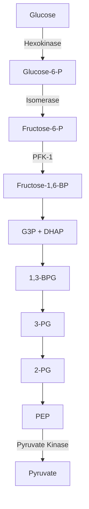
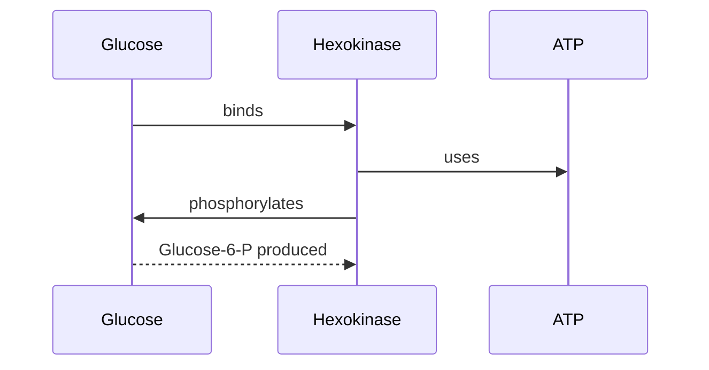

# Ken Content Creation Guide

This document defines the exact file formats, conventions, and examples needed to create content for `ken`. Any AI model or human can use this as the single reference for generating study materials.

## Directory Structure

```
~/Documents/learn/subjects/
└── <subject-name>/
    ├── concepts/
    │   ├── topic-1.md
    │   └── topic-2.md
    ├── flashcards/
    │   ├── topic-1.md
    │   └── topic-2.md
    ├── quizzes/
    │   ├── topic-1.md
    │   └── topic-2.md
    └── notes/              ← raw readable content (lecture slides, textbook extracts)
        ├── lecture-1.md
        └── chapter-14.md
```

- **Subject name**: lowercase, hyphenated (e.g., `biochemistry`, `cell-biology`)
- **One file = one set**: each `.md` file contains a set of related concepts, cards, or questions
- **IDs must be unique per subject** across ALL files (concepts, flashcards, quizzes)
- **No `progress.json` needed** — ken creates it automatically on first run
- **`notes/`**: raw readable content — lecture slides, textbook extracts, any markdown you want to read

---

## Concept Files

Location: `concepts/<topic>.md`

Concepts define what the learner is studying. Each concept can have a parent (hierarchy), a description, a summary, diagrams, and links.

### Full Format

```markdown
---
format_version: 1
type: concept_set
set: Glycolysis
concepts:
  - id: c-glycolysis
    name: Glycolysis
    parent_id: null
  - id: c-pfk1
    name: Phosphofructokinase-1
    parent_id: c-glycolysis
  - id: c-hexokinase
    name: Hexokinase
    parent_id: c-glycolysis
  - id: c-pyruvate-kinase
    name: Pyruvate Kinase
    parent_id: c-glycolysis
---

## c-glycolysis
The metabolic pathway that breaks down glucose into pyruvate, yielding a net 2 ATP.

## c-glycolysis:summary
Glycolysis is the first step of cellular respiration, occurring in the cytoplasm.
It converts glucose to two molecules of pyruvate, producing a net gain of 2 ATP
and 2 NADH. The pathway consists of 10 enzymatic steps divided into two phases:
the energy investment phase (steps 1-5) and the energy payoff phase (steps 6-10).

## c-pfk1
The rate-limiting, committed enzyme of glycolysis. Catalyzes the phosphorylation
of fructose-6-phosphate to fructose-1,6-bisphosphate using ATP.

## c-pfk1:summary
PFK-1 is the key regulatory enzyme of glycolysis. It catalyzes the committed step
— the first irreversible reaction unique to glycolysis. Regulated allosterically:
- Inhibited by: ATP, citrate
- Activated by: AMP, fructose-2,6-bisphosphate
This regulation ensures glycolysis slows when energy is abundant and speeds up
when energy is needed.

## c-hexokinase
The first enzyme of glycolysis. Phosphorylates glucose to glucose-6-phosphate
using ATP.

## c-hexokinase:summary
Hexokinase catalyzes the first committed step of glucose metabolism. In the liver,
the isoform glucokinase serves the same role but with different kinetic properties
(higher Km, no product inhibition).

## c-pyruvate-kinase
The final enzyme of glycolysis. Catalyzes the transfer of a phosphate from
phosphoenolpyruvate (PEP) to ADP, yielding pyruvate and ATP.

## c-pyruvate-kinase:summary
Pyruvate kinase catalyzes the last step of glycolysis, producing the second
ATP via substrate-level phosphorylation. Regulated by:
- Activated by: fructose-1,6-bisphosphate (feedforward activation)
- Inhibited by: ATP, alanine
```

### Concept Fields

| Field | Required | Description |
|-------|----------|-------------|
| `id` | Yes | Unique ID. Prefix with `c-` by convention. Must be unique across ALL files in the subject |
| `name` | Yes | Human-readable name |
| `parent_id` | No | ID of parent concept for hierarchy. `null` or omit for root concepts |

### Body Sections

- `## <concept-id>` — Concept description (free text, supports markdown)
- `## <concept-id>:summary` — Summary of the concept (free text, supports markdown)

### Diagrams and Links

Add to the frontmatter per concept:

```yaml
concepts:
  - id: c-glycolysis
    name: Glycolysis
    parent_id: null
    diagrams:
      - id: glycolysis-pathway
        label: "Glycolysis Pathway"
        source: |
          graph TD
            A[Glucose] -->|Hexokinase| B[Glucose-6-P]
            B -->|Isomerase| C[Fructose-6-P]
            C -->|PFK-1| D[Fructose-1,6-BP]
            D --> E[G3P + DHAP]
            E --> F[1,3-BPG]
            F --> G[3-PG]
            G --> H[2-PG]
            H --> I[PEP]
            I -->|Pyruvate Kinase| J[Pyruvate]
      - id: krebs-overview
        label: "Krebs Cycle Overview"
        file: diagrams/krebs.mmd
    links:
      - url: "https://www.youtube.com/watch?v=abc123"
        title: "Glycolysis Explained"
        type: youtube
      - url: "https://en.wikipedia.org/wiki/Glycolysis"
        title: "Wikipedia: Glycolysis"
        type: website
      - url: "https://www.ncbi.nlm.nih.gov/books/..."
        title: "Lehninger Chapter 14"
        type: reference
```

**Diagram fields:**

| Field | Required | Description |
|-------|----------|-------------|
| `id` | Yes | Unique diagram ID |
| `label` | Yes | Display name |
| `source` | One of source/file | Inline mermaid syntax |
| `file` | One of source/file | Path to `.mmd` file relative to subject dir |

**Link types:** `youtube`, `website`, `reference`

---

## Flashcard Files

Location: `flashcards/<topic>.md`

Flashcards are the primary study mechanism. Each card has a front (question) and back (answer). Cards can optionally link to a concept for mastery tracking.

### Full Format

```markdown
---
format_version: 1
type: flashcard_set
set: Glycolysis Flashcards
source: BCH 208 - Glycolysis Lecture
cards:
  - id: bch-001
    concept_id: c-pfk1
    front: What is the rate-limiting enzyme of glycolysis?
    back: Phosphofructokinase-1 (PFK-1)
    tags: [glycolysis, enzymes, regulation]
  - id: bch-002
    concept_id: c-glycolysis
    front: What is the net ATP yield of glycolysis?
    back: 2 ATP per glucose molecule
    tags: [glycolysis, energy]
  - id: bch-003
    concept_id: c-hexokinase
    front: What does hexokinase do?
    back: Phosphorylates glucose to glucose-6-phosphate using ATP
    tags: [glycolysis, enzymes]
  - id: bch-004
    front: What are the two phases of glycolysis?
    back: Energy investment phase (steps 1-5) and energy payoff phase (steps 6-10)
    tags: [glycolysis]
  - id: bch-005
    concept_id: c-pyruvate-kinase
    front: What is substrate-level phosphorylation?
    back: Direct transfer of a phosphate group from a substrate to ADP to form ATP, without using the electron transport chain
    tags: [glycolysis, energy, mechanisms]
---

## Notes: bch-001
PFK-1 commits glucose to glycolysis — the committed, irreversible step regulated
allosterically by ATP/citrate (inhibitors) and AMP/F-2,6-BP (activators).

## Notes: bch-004
Think of it as: you spend 2 ATP early (investment), then make 4 ATP later (payoff).
Net = 4 - 2 = 2 ATP.
```

### Flashcard Fields

| Field | Required | Description |
|-------|----------|-------------|
| `id` | Yes | Unique card ID. Prefix with `bch-` or similar by convention |
| `concept_id` | No | Link to concept for mastery tracking. Without it, card still studies but doesn't affect concept confidence |
| `front` | Yes | The question/prompt |
| `back` | Yes | The answer |
| `tags` | No | Array of tags for organization |

### Body Sections

- `## Notes: <card-id>` — Optional hint/explanation text shown with the card

### ID Uniqueness

Card IDs must be unique across ALL flashcard files in the subject. If `bch-001` exists in `flashcards/glycolysis.md`, it cannot exist in `flashcards/lipids.md`. Ken will error on load if duplicates are found.

---

## Quiz Files

Location: `quizzes/<topic>.md`

Quizzes test knowledge with three question types: multiple choice, true/false, and fill-in-the-blank.

### Full Format

```markdown
---
format_version: 1
type: quiz_set
set: Glycolysis Quiz
questions:
  - id: bch-q001
    concept_id: c-pfk1
    type: mcq
    question: Which enzyme catalyzes the committed step of glycolysis?
    options:
      - Hexokinase
      - Phosphofructokinase-1
      - Pyruvate kinase
      - Aldolase
    answer: 1
    explanation: PFK-1 catalyzes the committed step — the first irreversible reaction unique to glycolysis. It is the key regulatory point.

  - id: bch-q002
    concept_id: c-glycolysis
    type: mcq
    question: What is the net ATP yield of glycolysis per glucose molecule?
    options:
      - 1 ATP
      - 2 ATP
      - 4 ATP
      - 6 ATP
    answer: 2
    explanation: Glycolysis produces 4 ATP total but consumes 2 ATP in the investment phase, yielding a net of 2 ATP.

  - id: bch-q003
    type: true_false
    question: Glycolysis occurs in the mitochondria
    answer: false
    explanation: Glycolysis occurs in the cytoplasm (cytosol), not the mitochondria. The citric acid cycle and oxidative phosphorylation occur in the mitochondria.

  - id: bch-q004
    type: true_false
    question: PFK-1 is inhibited by ATP and citrate
    answer: true
    explanation: ATP and citrate are allosteric inhibitors of PFK-1, signaling that the cell has sufficient energy.

  - id: bch-q005
    concept_id: c-hexokinase
    type: fill_blank
    question: "Glucose is phosphorylated to glucose-___-phosphate by hexokinase"
    answer: "6"
    explanation: Hexokinase phosphorylates glucose at the 6th carbon, producing glucose-6-phosphate.

  - id: bch-q006
    type: fill_blank
    question: "The committed step of glycolysis is catalyzed by phospho___okinase-1"
    answer: "fructo"
    explanation: Phospho-fructo-kinase-1 (PFK-1) catalyzes the committed step.

  - id: bch-q007
    concept_id: c-pyruvate-kinase
    type: mcq
    question: Which of the following activates pyruvate kinase?
    options:
      - ATP
      - Alanine
      - Fructose-1,6-bisphosphate
      - Citrate
    answer: 3
    explanation: Fructose-1,6-bisphosphate is a feedforward activator of pyruvate kinase. ATP, alanine, and citrate are inhibitors.
---
```

### Quiz Question Fields

| Field | Required | Description |
|-------|----------|-------------|
| `id` | Yes | Unique question ID. Prefix with `bch-q` or similar |
| `concept_id` | No | Link to concept for mastery tracking |
| `type` | Yes | `mcq`, `true_false`, or `fill_blank` |
| `question` | Yes | The question text |
| `options` | mcq only | Array of answer choices (1-indexed for answer) |
| `answer` | Yes | Correct answer (see format below) |
| `explanation` | No | Shown after answering |

### Answer Formats

- **mcq**: Integer (1-indexed) matching the options array position
- **true_false**: Boolean (`true` or `false`)
- **fill_blank**: String (case-insensitive comparison)

### Unknown Types

If a question has a `type` that isn't `mcq`, `true_false`, or `fill_blank`, ken skips it with a warning — it never crashes.

---

## ID Naming Conventions

Use consistent prefixes to avoid collisions and make IDs self-documenting:

| Content Type | Prefix | Example |
|-------------|--------|---------|
| Concept | `c-` | `c-pfk1`, `c-glycolysis` |
| Flashcard | `bch-` (or subject prefix) | `bch-001`, `bch-002` |
| Quiz question | `bch-q` | `bch-q001`, `bch-q002` |
| Diagram | any descriptive | `glycolysis-pathway`, `krebs-cycle` |

**Critical rule**: IDs must be unique across ALL files in a subject. A card ID `bch-001` in `flashcards/glycolysis.md` cannot also exist in `flashcards/lipids.md`.

---

## Markdown in Content

All free-text fields (concept descriptions, summaries, card notes, quiz explanations) support markdown:

- **Bold**: `**text**`
- *Italic*: `*text*`
- `Code`: `` `code` ``
- Lists: `- item` or `1. item`
- Headers: `## Header`
- Links: `[text](url)`
- Code blocks: triple backticks with language

Ken renders markdown in the TUI using glamour. Keep it simple — no complex HTML or custom extensions.

---

## Mermaid Diagrams

Diagrams use [Mermaid](https://mermaid.js.org/) syntax. Supported types:

- Flowcharts: `graph TD`, `graph LR`, `graph RL`, `graph BT`
- Sequence diagrams: `sequenceDiagram`
- Class diagrams: `classDiagram`
- ER diagrams: `erDiagram`
- Mind maps: `mindmap`
- Gantt charts: `gantt`

### Example Flowchart



### Example Sequence Diagram



---

## Raw Content Files (notes/)

Location: `notes/<topic>.md`

These are plain markdown files for reading — lecture slides, textbook extracts, study notes. No YAML frontmatter required, no special structure. Just write markdown.

### Example

```markdown
# Glycolysis Lecture Notes

## Overview
Glycolysis is the metabolic pathway that converts glucose into pyruvate.
It occurs in the cytoplasm and does not require oxygen.

## The 10 Steps

### Step 1: Phosphorylation of Glucose
- Enzyme: **Hexokinase**
- Glucose → Glucose-6-phosphate
- Uses 1 ATP
- Irreversible

### Step 2: Isomerization
- Enzyme: **Phosphoglucose isomerase**
- Glucose-6-phosphate → Fructose-6-phosphate

... (continue for all 10 steps)

## Key Regulation Points
1. **Hexokinase** — inhibited by glucose-6-phosphate (product inhibition)
2. **PFK-1** — the committed step, inhibited by ATP/citrate
3. **Pyruvate kinase** — activated by F-1,6-BP, inhibited by ATP/alanine
```

### Reading Content

```bash
ken read <subject>   # browse and read notes with markdown rendering
```

Use `j`/`k` to navigate between files, `enter` to view content. Markdown is rendered with glamour for beautiful terminal display.

Here's a minimal but complete subject with all file types:

### `~/Documents/learn/subjects/biochemistry/notes/glycolysis.md`

```markdown
# Glycolysis Lecture Notes

## The 10 Steps

### Energy Investment Phase (Steps 1-5)
1. **Glucose → Glucose-6-P** (Hexokinase, -1 ATP)
2. **Glucose-6-P → Fructose-6-P** (Phosphoglucose isomerase)
3. **Fructose-6-P → Fructose-1,6-BP** (PFK-1, -1 ATP) ← COMMITTED STEP
4. **Fructose-1,6-BP → G3P + DHAP** (Aldolase)
5. **DHAP → G3P** (Triosephosphate isomerase)

### Energy Payoff Phase (Steps 6-10)
6. **G3P → 1,3-BPG** (G3P dehydrogenase, +2 NADH)
7. **1,3-BPG → 3-PG** (Phosphoglycerate kinase, +2 ATP)
8. **3-PG → 2-PG** (Phosphoglycerate mutase)
9. **2-PG → PEP** (Enolase, -2 H2O)
10. **PEP → Pyruvate** (Pyruvate kinase, +2 ATP)

## Net Yield
- 2 ATP (4 produced - 2 invested)
- 2 NADH
- 2 Pyruvate
```

### `~/Documents/learn/subjects/biochemistry/concepts/glycolysis.md`

```markdown
---
format_version: 1
type: concept_set
set: Glycolysis
concepts:
  - id: c-glycolysis
    name: Glycolysis
    parent_id: null
  - id: c-pfk1
    name: Phosphofructokinase-1
    parent_id: c-glycolysis
---

## c-glycolysis
The metabolic pathway that breaks down glucose into pyruvate.

## c-glycolysis:summary
First step of cellular respiration. Net 2 ATP per glucose. Occurs in cytoplasm.

## c-pfk1
Rate-limiting enzyme of glycolysis.

## c-pfk1:summary
Commits glucose to glycolysis. Inhibited by ATP/citrate, activated by AMP/F-2,6-BP.
```

### `~/Documents/learn/subjects/biochemistry/flashcards/glycolysis.md`

```markdown
---
format_version: 1
type: flashcard_set
set: Glycolysis Cards
cards:
  - id: bch-001
    concept_id: c-pfk1
    front: Rate-limiting enzyme of glycolysis?
    back: PFK-1
  - id: bch-002
    concept_id: c-glycolysis
    front: Net ATP yield of glycolysis?
    back: 2 ATP
---
```

### `~/Documents/learn/subjects/biochemistry/quizzes/glycolysis.md`

```markdown
---
format_version: 1
type: quiz_set
set: Glycolysis Quiz
questions:
  - id: bch-q001
    concept_id: c-pfk1
    type: mcq
    question: Which enzyme is rate-limiting?
    options: [Hexokinase, PFK-1, Pyruvate kinase]
    answer: 2
    explanation: PFK-1 is the rate-limiting enzyme.
  - id: bch-q002
    type: true_false
    question: Glycolysis yields 4 ATP net
    answer: false
    explanation: Net yield is 2 ATP (4 produced - 2 invested).
---
```

---

## Checklist for AI Content Generation

When creating content for ken, verify:

- [ ] **File format**: YAML frontmatter + markdown body
- [ ] **Type field**: `concept_set`, `flashcard_set`, or `quiz_set`
- [ ] **Format version**: Always `1`
- [ ] **IDs unique per subject**: No duplicate IDs across concept/flashcard/quiz files
- [ ] **Concept IDs**: Prefixed with `c-`, referenced correctly in `concept_id` fields
- [ ] **Card IDs**: Prefixed with subject code (e.g., `bch-`), referenced in `## Notes:` sections
- [ ] **Quiz IDs**: Prefixed with subject code + `q` (e.g., `bch-q001`)
- [ ] **Quiz answer format**: mcq = 1-indexed integer, true_false = boolean, fill_blank = string
- [ ] **Body sections**: `## <id>` for concepts, `## Notes: <id>` for cards
- [ ] **Summary sections**: `## <id>:summary` for concept summaries
- [ ] **No empty required fields**: Every card needs `front` and `back`, every question needs `question` and `answer`
- [ ] **Mermaid syntax valid**: Test diagrams before including
- [ ] **Markdown clean**: No broken formatting, no unclosed tags

---

## Common Mistakes

1. **Duplicate IDs**: `bch-001` in two different files → ken crashes on load
2. **Wrong answer format**: mcq answer `1` (correct) vs `"1"` (wrong — must be integer)
3. **Missing type field**: Every file needs `type: concept_set`, `type: flashcard_set`, or `type: quiz_set`
4. **Wrong parent_id**: Referencing a concept ID that doesn't exist → warn + treat as root
5. **Empty concept body**: `## c-something` with no text → empty description, still works but not useful
6. **Mermaid syntax errors**: Invalid mermaid → diagram rendering fails silently
7. **YAML quoting**: Strings with special characters need quotes: `question: "What is 2+2?"`
